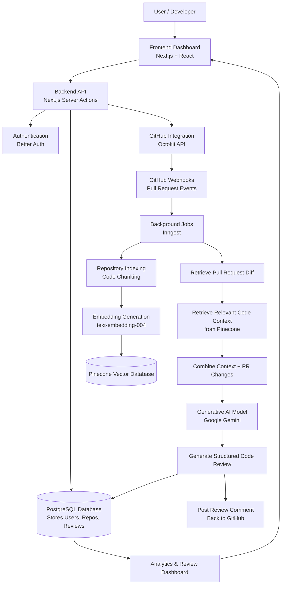

# 1. Project Overview

- The project aims to develop an AI-powered context-aware code review platform that automatically analyzes pull requests and provides intelligent feedback to developers.
- The system belongs to the domains of Artificial Intelligence, DevOps Automation, and Cloud-based Software Engineering.
- It integrates with repositories hosted on GitHub to monitor code changes and assist in the review process.
- The problem area is relevant because modern development teams handle large and complex repositories where manual code reviews are often slow and inconsistent.
- The platform uses AI and semantic search techniques to improve the efficiency and quality of the code review workflow.
- The solution is designed for software developers, engineering teams, and organizations working in collaborative development environments.

# 2. Problem Statement

- Modern software development relies on pull requests to integrate code changes and maintain collaboration among developers.
- Manual code reviews are time-consuming and heavily dependent on the availability of experienced developers.
- As repositories grow larger and more complex, reviewers often lack full visibility of the entire codebase, leading to missed bugs, architectural issues, or security vulnerabilities.
- This problem affects software developers, development teams, and organizations working on collaborative platforms such as GitHub.
- Most existing automated tools analyze only the modified files in a pull request and do not consider the full repository context.
- Because of this limitation, the feedback generated by current tools is often incomplete or shallow.
- This creates a gap for a system that can provide context-aware, intelligent, and automated code review insights.

# 3. Objectives of the Project

- Design a web-based platform that integrates with repositories on GitHub to monitor and analyze pull requests.
- Develop a context-aware code review system that retrieves relevant repository information before analyzing code changes.
- Implement a generative AI model to automatically generate structured code review feedback, including summaries and improvement suggestions.
- Build a repository indexing system using vector embeddings to enable semantic search and contextual understanding of the codebase.
- Evaluate the system’s ability to assist developers by improving the speed and consistency of the code review process.

# 4. Proposed Solution / Methodology

## Proposed Approach
- The system will integrate with repositories hosted on GitHub to monitor pull request activities using webhooks.
- When a pull request is created or updated, the system retrieves the modified code files and processes them for analysis.
- The repository is first indexed by dividing source code into smaller segments and converting them into vector embeddings.
- These embeddings are stored in a vector database to enable semantic search across the repository.
- When analyzing a pull request, the system retrieves relevant code context from the repository and combines it with the code changes.
- The combined information is analyzed using a generative AI model to produce structured code review feedback including summaries, issues, and suggestions.
- The generated review results are stored in the system database and displayed in the dashboard, and can also be posted directly as comments on the pull request.

## Main System Modules
- **User Interface Module** – Provides a dashboard where users can connect repositories and view review results.
- **Repository Integration Module** – Connects with GitHub repositories and monitors pull request events.
- **Repository Indexing Module** – Converts repository code into embeddings for semantic search.
- **Context Retrieval Module** – Retrieves relevant code segments from the vector database during review analysis.
- **AI Review Module** – Uses generative AI to analyze code changes and generate structured review feedback.
- **Review Management Module** – Stores review results and provides analytics and history tracking.

## System Architecture Diagram

# 5. Key Technologies and Tools

## Programming Languages
- TypeScript
- JavaScript

## Frameworks and Libraries
- Next.js – for building the frontend and backend application
- React – for developing the user interface
- Tailwind CSS – for styling the web interface

## Databases
- PostgreSQL – for storing application data such as users, repositories, and review results
- Pinecone Vector Database – for storing code embeddings and enabling semantic search

## AI and Machine Learning
- Google Gemini – for generating automated code review feedback
- Text Embedding Model (text-embedding-004) – for converting code into vector embeddings

## Development Platforms and APIs
- GitHub API (Octokit) – for repository integration and pull request monitoring
- Prisma ORM – for database management and queries
- Inngest – for handling background processing tasks such as repository indexing and AI review generation

# 6. V.E.T.S Justification

## V – Viability
- The project is feasible within the given timeline because it uses existing technologies and APIs, including the GitHub API, generative AI services, and vector databases that simplify development.
- The required tools such as Next.js, PostgreSQL, AI APIs, and vector databases are widely available, and the development team has the necessary full-stack and AI integration skills to implement the system.

## E – Engineering Depth
- The system includes the implementation of a Retrieval-Augmented Generation (RAG) pipeline, which involves repository indexing, vector embedding generation, and semantic search.
- The project requires integration of multiple technologies such as AI models, GitHub APIs, databases, and background processing, demonstrating significant system architecture and engineering complexity.

## T – Trend Alignment
- The project aligns with the growing use of Artificial Intelligence and Machine Learning in software development tools to automate tasks and improve productivity.
- It also follows modern trends in cloud-based and AI-assisted development platforms, where intelligent systems support developers during the software development lifecycle.

## S – Social / Industrial Impact
- The system can improve developer productivity and efficiency by reducing the time required for manual code reviews and providing faster feedback.
- It contributes to the digital transformation of software development, helping organizations maintain better code quality and more reliable software systems.

# 7. Expected Outcomes
- A functional AI-powered web platform that integrates with repositories on GitHub and automatically analyzes pull requests.
- An automated context-aware code review system that generates structured feedback such as summaries, detected issues, and improvement suggestions.
- A repository indexing mechanism that converts code into vector embeddings to enable semantic search and contextual understanding of the codebase.
- An AI-based review engine that combines pull request changes with repository context to generate intelligent review insights.
- A dashboard interface where users can connect repositories, view generated reviews, and monitor repository activity.
- A demonstration setup where the platform analyzes sample pull requests and displays the generated code review results.

# 8. Implementation Timeline

| Phase | Activity |
|---|---|
| **Phase 1** | Problem analysis and requirement study, understanding pull request workflows and reviewing existing code review tools. |
| **Phase 2** | System design and architecture planning, including defining modules, database structure, and AI integration workflow. |
| **Phase 3** | Implementation and development of core modules such as repository integration, indexing system, AI review engine, and dashboard interface. |
| **Phase 4** | System testing and evaluation using sample repositories and pull requests to verify functionality and accuracy of generated reviews. |
| **Phase 5** | Documentation preparation, system demonstration, and final project presentation. |

# 9. References
- Lewis, P., et al. (2020). Retrieval-Augmented Generation for Knowledge-Intensive NLP Tasks. Advances in Neural Information Processing Systems (NeurIPS).
- Vaswani, A., et al. (2017). Attention Is All You Need. Advances in Neural Information Processing Systems.
- Chen, M., et al. (2021). Evaluating Large Language Models Trained on Code. arXiv preprint arXiv:2107.03374.
- Feng, Z., et al. (2020). CodeBERT: A Pre-Trained Model for Programming and Natural Languages. Findings of the Association for Computational Linguistics (ACL).
- GitHub. GitHub REST API Documentation – https://docs.github.com
- Google. Gemini AI Documentation – https://ai.google.dev
- Pinecone. Pinecone Vector Database Documentation – https://www.pinecone.io/docs
- Vercel. Next.js Framework Documentation – https://nextjs.org/docs
- Prisma. Prisma ORM Documentation – https://www.prisma.io/docs
- TanStack. TanStack Query Documentation – https://tanstack.com/query
